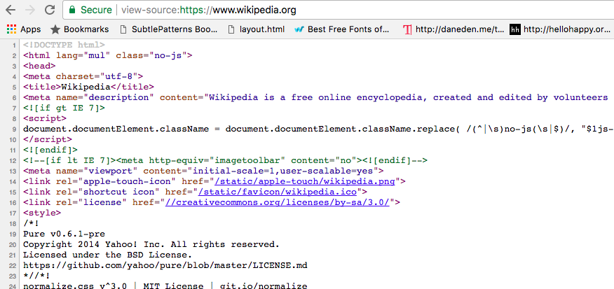
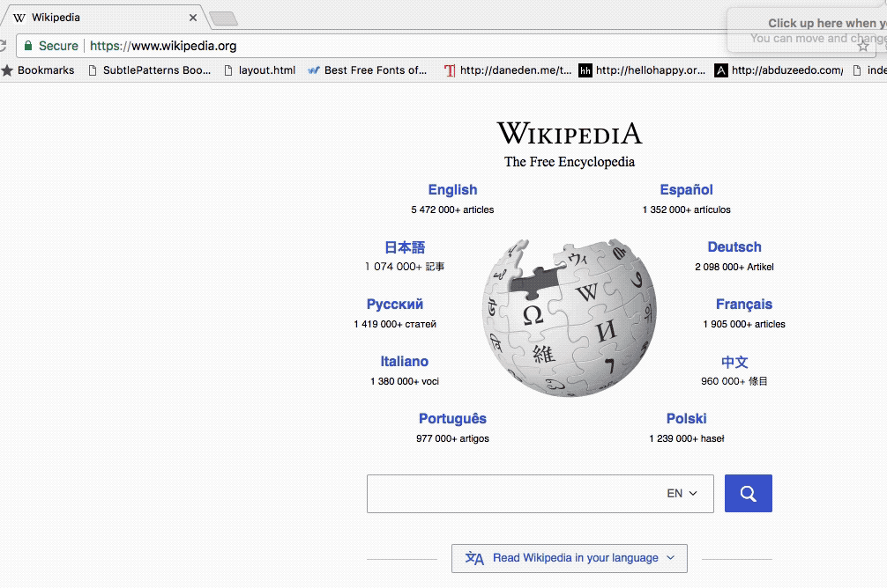
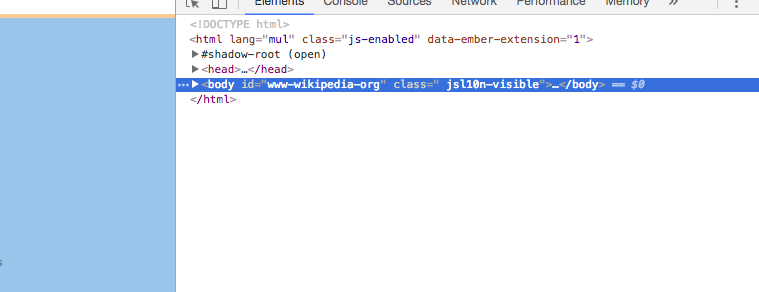
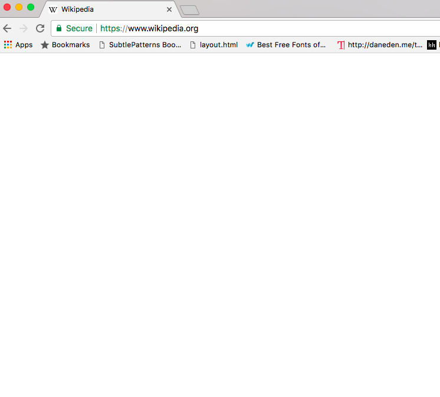

# Introduction to the DOM

## Objectives

1. Explain what the DOM is
2. Explain how the DOM came to be
3. Select DOM elements

### Back to our HTML

In this lesson, we will discuss the difference between HTML and something new: the Document Object Model. HTML that constructs any website that we visit. In fact, let's learn how to can see the HTML of any site.

> Note: We recommend that you use Google Chrome.  (You can download chrome [here](https://www.google.com/chrome/browser/desktop/index.html)). Chrome has many features that are developer friendly, and because of that, it is one of the tools that many developers use.

1. Change the url of your website to view source

Here's how you do it. From a Google chrome browser, go to the url of a webpage.  We are going to the page `https://www.wikipedia.org/`.  Then to see the HTML of that page simply, add on `view-source:` to the front of the url.  So we are changing our url to `view-source:https://www.wikipedia.org/`.

If you examine your browser, you will see the HTML used to construct the wikipedia.  It will look something like this:



The browser interprets the HTML you see, along with the styles (CSS) and Javascript to construct the appearances in the browser.  

Notice that what we see in our the view source tab looks very similar to HTML you may have seen previously.

```html
<!DOCTYPE html>
	<html>
	  <head>
	    <meta charset="utf-8">
	    <title></title>
	      <link rel="stylesheet" href="style.css">
  	</head>
  <body>
    <header>....</header>
    
  </body>
  <script src="https://raw.githubusercontent.com/learn-co-curriculum/js-and-the-web/master/spin.js" charset="utf-8"></script>
</html>

```

It may look like our browser is simply displaying the HTML that we see.  For example, surrounding the center image on the Wikipedia page appear the various languages that Wikipedia has articles in.  And if we search through our HTML (by pressing control+f or command+f) we can see that same title "Italiano" in the content of our HTML.  So is it fair to say that our browser simply displays a webpage's HTML?   

Not exactly.  Instead, our browser is directly displaying the Document Object Model of the respective webpage. What does that mean?  What is the Document Object Model, and how is it different than the HTML for the page?

### So then what is the Document Object Model

The best way to understand the Document Object Model, is to see and interact with it. Let's get to it.

#### 1. Open the console



> From the webpage displaying Wikipedia, right click (or two fingers click on a Mac) and select the select the last option in the dropdown that you see, labeled "inspect".  The Google Develepor console will either pop up on the right or the bottom of your screen.

> From this webpage, look at the Chrome menubar at the top of the page. Click on "View", then select "Developer", then "Developer Tools". This will open the Google Developer Console.

#### 2. Manipulate the DOM




When you open the Google Developer Console, you will see what looks like HTML. There are head tags, body tags, divs, etc. Now from inside the developer console, click on the element that says `body`, and then press the delete button on your keyboard. You should the content of your wikipedia page disappear. You just deleted it!



Now did you just delete the HTML? No. Let's prove it.

View the page source. Right click (or two fingers click on the mac) on the lesson page in the browser and select view page source.  You will see the that the HTML is just as it always was, with a header tag and lots of other elements inside.  


The changes that the **developer console** caused, and the changes the **developer console** currently displays are changes in the *Document Object Model* (which we still didn't explain), but not in our *HTML*. Our webpage now looks blank, reflecting the missing header in our DOM, even though our HTML still has content in the header tags.  

So what are we concluding? We're concluding that by changing the Document Object Model, we can change the way our webpage displays. And we can do this even if our HTML is unchanged.  

### Tell it to me in bullet points

  * The Document Object Model is a representation of the *current view* of the browser, and can be manipulated without reloading a page.  
  * The HTML is the text in a file first used to display the page.

So the HTML is essentially the starting point of the page's content. But as we just saw by deleting the header of the page, what is displayed can change. When we change it, we change the Document Object Model, and that changes the appearance in the browser. The HTML, however, once loaded on a webpage, does not change.  

### This is still about Javascript, right?

Ok, so what does this have to do with Javascript?  

Well, with Javascript we can (1) view a current representation of our Document Object Model. With Javascript we can also (2) select specific portions of the DOM, and manipulate them, which changes what shows up in a browser window.

Let's get to it.

1. Use Javascript to view the current representation of the DOM

	From inside the developer console, click on the tab that says the word console. Then at the bottom you will see a cursor.  

	There, type the word `document` and press Enter. You'll get a `#document` returned. Click the Triangle and you'll see the DOM! If you followed along above, you'll see a `head` tag, but no `body` tag. So by typing in `document` it looks like our body tag is gone. The page displays our body as gone. However, if we view page source, the HTML is unchanged. Remember, this is the difference between the DOM (current representation of the page) and the HTML (The initial representation of the page).

2. Use Javascript to manipulate our DOM

**Refresh your browser to get the body content back** Now let's start over and remove the body tag **with JavaScript**. Open up the console and type in the following and press Enter.

  ```javascript
   document.querySelector('body')
  ```

This will return something like this: 

```js
<header class="site-header">...</header>
```

Go ahead and click on that display triangle to see more.

It retrieves the header tag, which contains the lesson title among other things. Ok, now let's do something with this header. Open up the console, and type in the following:

```javascript
   document.querySelector('header').remove()
```

Take a look at the top of the page again. The header is gone. But do you think the HTML has just changed? Well, no. As you know, the HTML never changes after it is first rendered. Instead, we accessed the Document Object Model, altered the model and that altered the appearance of our web page. This is the same as we did before, but with code. **To get the header back, just hit refresh**

### Summary

We learned a lot in this section. This is what we learned.  

* HTML is a markup language used to display content in a browser. When we change the appearance of a webpage, what we are really changing is the Document Object Model, which directly determines the appearance displayed in the browser.  
* We can view and manipulate the Document Object Model by opening our developer tools, but when we do so the HTML is not changed.  
* We can also view our Document Object Model by opening the console and typing in the word `document`.
* We can select a specific piece of the DOM by using Javascript, such as `document.querySelector('header')`, and we can also use Javascript to alter our DOM with `document.querySelector('header').remove()`
* **To get your header back, just hit refresh**


### What's next

Next, we'll take a deeper look at how to select elements!

## Resources

- [CSS Tricks - What is the DOM?](https://css-tricks.com/dom/)
- [MDN - The DOM](https://developer.mozilla.org/en-US/docs/Web/API/Document_Object_Model/Introduction)
